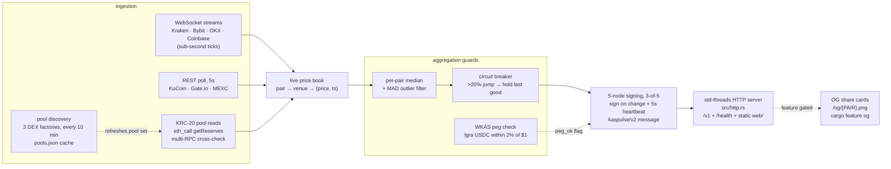

# kaspulse architecture

How a market tick becomes a threshold-signed, verifiable price. Everything
below is one process (`cargo run --bin oracle`), std threads only — the
[build-features table](#build-features--and-why-the-default-build-has-no-tokio)
explains why the default build has no async runtime.

## The pipeline, stage by stage

**1. Ingestion — seven exchanges plus the chain itself.** Majors (KAS, BTC,
ETH) stream over WebSocket from Kraken, Bybit, OKX and Coinbase (BTC/ETH only —
Coinbase doesn't list KAS); Kraken subscribes with `event_trigger=bbo` and
prices the bid/ask mid so low-volume pairs stay fresh between trades. A slow
REST thread adds KuCoin, Gate.io and MEXC every 5 s. Every write lands in one
shared price book (`pair → venue → (price, ts_ms)`); anything older than 30 s
(`STALE_MS`) is ignored downstream. WS connections reconnect with exponential
backoff (2 s → 30 s cap).

**2. KRC-20 pool reads — our own on-chain source.** Each KRC-20 price comes
from reading `getReserves()` directly on the DEX pair contract via `eth_call` —
no third-party price API in the path. Each read is **cross-checked across
RPCs**: with ≥2 RPCs configured (`KASPLEX_RPCS` / `IGRA_RPCS`), all responses
must agree byte-for-byte or the read is dropped — a single compromised RPC
can't move a price. The pool price (in WKAS) × the CEX KAS/USD median gives
USD; each (pair, chain) keeps a 12-sample windowed median (~60 s TWAP at the
5 s cadence) that kills single-block flash-loan spikes. Pools under 1000 WKAS
of liquidity get `thin: true` — real price, shallow book, manipulable.

**3. Pool discovery — self-maintaining coverage.** A background thread
re-enumerates three DEX factories on-chain (Kasplex/Zealous, Igra/Zealous,
Igra/KaspaCom) every 10 minutes: pair count → pair addresses → token symbols/
decimals, all via cross-checked `eth_call`. New tokens appear without a
restart; the result is written to `pools.json`, which doubles as the startup
cache (discovery first runs 45 s after boot). A sanity gate refuses to replace
the live set with a near-empty enumeration (<10 pools); an empty discovery is
also the `KASPULSE_DISCOVERY_EMPTY` alert token in production logs.

**4. Aggregation guards** (constants from `src/main.rs`):

| guard | rule | on trigger |
|---|---|---|
| staleness | source older than 30 s (`STALE_MS`) | source excluded from the median |
| MAD outlier filter | with ≥4 sources, drop any source farther than `max(4×MAD, 0.3%)` from the median; never below 2 survivors | dropped venues listed in `outliers` |
| circuit breaker | a >20 % one-round jump (`BREAK_PCT`) | publish the **last good** price with `halted: true`, until the move persists 12 rounds (`BREAK_ROUNDS`, ~5 s) — then it's a real move |
| degraded | a major down to <2 live sources | `degraded: true` |
| WKAS peg check | Igra's USDC/USD implied price outside ±2 % of $1.00 (`PEG_TOL`) | `peg_ok: false` on Igra-sourced feeds + envelope `peg` object — a bridge depeg makes every price on that chain suspect |
| thin pool | KRC-20 pool liquidity < 1000 WKAS (`MIN_LIQ_WKAS`), re-measured every round | `thin: true` |

The flags are published, not hidden — a consumer that ignores `halted`,
`thin`, `degraded` or `peg_ok` is choosing to.

**5. Signing — 5 nodes, 3-of-5, on change.** Every serve tick (400 ms) the
build loop medians the fresh sources per pair, normalizes to `mant × 10^expo`
(9 significant digits at any magnitude — see
[MESSAGE-FORMAT.md](MESSAGE-FORMAT.md) §6), and signs
`kaspulse/v2|PAIR|mant|expo|ts|round` with each of the 5 node keys —
**only when the price changed**, with a 5 s heartbeat re-sign for unchanged
prices. `signed_ts`/`signed_round` identify the attestation; the envelope's
`timestamp`/`round` identify the serve tick. Honest label: in this hosted
deployment the 5 keys sign in one process — the cryptography is the real
3-of-5, the *deployment* is not yet 5 independent operators. The standalone
`signer` daemon ([OPERATOR.md](OPERATOR.md)) is the path there.

**6. Serving — `src/http.rs`, plain std.** A hand-rolled threads-and-sockets
HTTP server: read/write timeouts, a global connection cap, canonicalized
static paths (must resolve under `web/`), CORS `*`, OPTIONS preflight,
`/health`, versioned `/v1` routes with permanent legacy aliases
(`/api/feed`, `/feed.json`), and `/share/{PAIR}` + `/sitemap.xml` for link
unfurls. Responses are **pre-serialized once per round** in the build loop
(full envelope + a per-pair map + the `/v1/feeds` catalog) — a request is a
map lookup, not a serde pass. The full route list lives in the site's
[#/dev reference](../web/index.html); the API surface is frozen at v1.

**7. OG cards — `cargo` feature `og`.** `GET /og/{PAIR}.png` renders a
1200×630 share card (pair, live price, sparkline, the "median of N venues ·
3-of-5 signed" trust line, thin/halted badges on the card itself) via `resvg`
with an embedded font. Only compiled in the Dockerfile build; without the
feature the routes 404 and nothing else changes. A 5 s per-pair memo bounds
render cost.

## Thread map

| thread | defined in | cadence | does |
|---|---|---|---|
| `ws_kraken`, `ws_bybit`, `ws_okx`, `ws_coinbase` | `src/main.rs` | event-driven | one WS stream each → price book; reconnect w/ backoff |
| `slow_thread` | `src/main.rs` | 5 s | REST venues + KRC-20 pool reads (chunks of 12, scoped threads) → price book |
| `discover_thread` | `src/main.rs` | 10 min (first at +45 s) | factory re-enumeration → `pools.json` + live pool set |
| build/sign loop | `src/main.rs` | 400 ms | median → guards → sign (change/heartbeat) → pre-serialized responses |
| HTTP acceptor + per-connection threads | `src/http.rs` | per request | serve `/v1`, `/health`, static `web/`, share/og; timeouts + connection cap |

## Key files

| file | what it is | custody |
|---|---|---|
| `kaspulse-node-{0..4}.key` | the 5 committee secret keys (64-char hex) | gitignored (`*.key`). Local dev: files in the repo root, auto-generated with a warning if absent. **Production: injected as `KASPULSE_NODE_KEYS` from Secret Manager** (`scripts/setup-keys.sh`); with `KASPULSE_REQUIRE_KEYS=1` (deploy.sh sets it) missing/malformed keys log `KASPULSE_KEYS_MISSING` and exit — a keyless restart must never silently mint a new committee, because committee continuity is what verifiers pin |
| `signer.key` (or the path you pass) | one independent operator's key for the `signer` daemon | gitignored; the operator's own |
| `~/.kaspulse/tn10.key` | funded testnet-10 key used by the on-chain bins (`gate`, `consumer_live`, `slash_live`, `latency`) | outside the repo; testnet funds only |
| `gate-node-{i}.key` | the local **demo** covenant committee written by `gate keygen` | gitignored; demo keys, honestly labeled — the hosted committee does not sign the covenant encoding yet (see [MESSAGE-FORMAT.md](MESSAGE-FORMAT.md) §8) |
| `pools.json` | discovered-pool cache (not a key) | committed snapshot; refreshed at runtime by discovery |

## Build features — and why the default build has no tokio

| feature | adds | binaries |
|---|---|---|
| *(default)* | ureq, tungstenite, secp256k1, blake2b_simd, serde_json — no async runtime | `oracle`, `verify`, `signer`, `wsspike` |
| `og` | resvg + one embedded JetBrains Mono face (`include_bytes!`) → `/og/{PAIR}.png` | `oracle` (enabled only in the Dockerfile) |
| `onchain` | the rusty-kaspa tx stack (wRPC client, consensus-core, txscript) + tokio | `onchain`, `consumer_live`, `slash`, `slash_live`, `latency`, `gate` |

The oracle's concurrency is a handful of long-lived threads doing blocking
I/O — WS reads, 5 s polls, a 400 ms loop, one thread per HTTP connection with
a global cap. An async runtime buys nothing here and costs compile time,
dependency surface and a second way to write every function. Tokio enters
only where it's genuinely required — the Kaspa wRPC client — and therefore
rides the `onchain` feature. The default build compiles in seconds and the
whole trust-relevant core (fetch → median → sign → serve) stays small enough
to read in one sitting.
