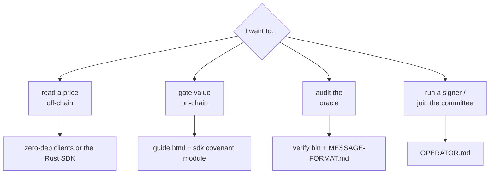

# Integrating kaspulse — pick your branch

One question decides everything: **what do you want the price for?**



Status, honestly, before you build: see the
[README's status section](../README.md#status-honestly) — oracle live and
real, on-chain consumers proven on testnet-10, mainnet publishing next.

---

## 1. Read a price off-chain

Poll `/v1/feed/{PAIR}` and **verify the signatures locally** — never trust
the API. Single-file zero-dependency clients: [`clients/py/kaspulse.py`](../clients/py/kaspulse.py)
(stdlib-only Python) and [`clients/js/kaspulse.mjs`](../clients/js/kaspulse.mjs)
(Node 18+/browser). Rust: the [`kaspulse-sdk`](../sdk/) crate, whose
`checked_value_fresh` refuses unverified, halted, depegged or stale prices in
one call. Dashboards should poll the light `/v1/feeds` catalog instead of the
full envelope.

```rust
let f = kaspulse_sdk::fetch(BASE, "KAS/USD")?;
let price = f.checked_value_fresh(std::time::Duration::from_secs(30))?; // verified or Err
```

## 2. Gate value on-chain

A Kaspa covenant can refuse to release a coin unless a threshold of oracle
signatures verifies **and** the price clears your condition — enforced by L1
script at spend time, no trust in this server. Start with the walkthrough
[**/guide.html**](../web/guide.html) (real testnet-10 txids, ~15 minutes; note
its demo-committee caveat), then build with the SDK's `covenant` module
(`price_gate_redeem_dir`, `range_settle_redeem`, witness/P2SH helpers — see
[`sdk/README.md`](../sdk/README.md)).

```rust
use kaspulse_sdk::covenant::{price_gate_redeem_dir, Gate};
let redeem = price_gate_redeem_dir(&committee, strike_e8, Gate::AtOrAbove);
```

## 3. Audit us

The message format, hashing and signature scheme are fully specified in
[**MESSAGE-FORMAT.md**](MESSAGE-FORMAT.md) — enough to write your own verifier
from scratch, with a deterministic end-to-end test vector. For maximum
paranoia, the `verify` bin trusts the oracle for *nothing*: it re-checks every
node signature **and** re-fetches the exchanges to recompute the median
itself.

```sh
cargo run --bin verify            # or: cargo run --bin verify -- <feed url>
```

## 4. Run a signer / join the committee

The oracle's decentralization path runs through independent operators — your
own machine, your own key, your own market view. Setup, the `/attest`
contract, a systemd unit, monitoring, and **exactly which behavior gets a bond
slashed** (only equivocation) are all in [**OPERATOR.md**](OPERATOR.md).

```sh
cargo run --release --bin signer -- operator.key 9099
```
