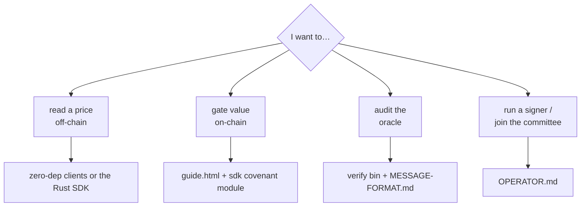

# Integrating kaspulse — pick your branch

One question decides everything: **what do you want the price for?**


```mermaid
flowchart TD
    Q{"I want to…"}
    Q --> A["read a price<br/>off-chain"]
    Q --> B["gate value<br/>on-chain"]
    Q --> C["audit the<br/>oracle"]
    Q --> D["run a signer /<br/>join the committee"]
    A --> A1["zero-dep clients or the Rust SDK"]
    B --> B1["guide.html + sdk covenant module"]
    C --> C1["verify bin + MESSAGE-FORMAT.md"]
    D --> D1["OPERATOR.md"]
```

Status, honestly, before you build: see the
[README's status section](../README.md#status-honestly) — oracle live and
real; on-chain consumers ran on testnet-10 (the bond record changed 2026-07-27, so the slashing script awaits a fresh TN10 run); mainnet publishing next.

---

## 1. Read a price off-chain

Poll `/v1/feed/{PAIR}` and **verify the signatures locally** — never trust
the API. Single-file zero-dependency clients: [`clients/py/kaspulse.py`](../clients/py/kaspulse.py)
(stdlib-only Python) and [`clients/js/kaspulse.mjs`](../clients/js/kaspulse.mjs)
(Node 18+/browser). Rust: the [`kaspulse-sdk`](../sdk/) crate, whose
`checked_value_fresh` refuses unverified, halted, depegged or stale prices in
one call. Dashboards should poll the light `/v1/feeds` catalog instead of the
full envelope.

```rust
let f = kaspulse_sdk::fetch(BASE, "KAS/USD")?;
let price = f.checked_value_fresh(std::time::Duration::from_secs(30))?; // verified or Err
```

**If you consume a KRC-20 feed, read three more fields.** `move_10pct_usd` is
the USD trade size that moves that price 10% on its shallowest pool — set your
own line on it rather than trusting our `thin` boolean (which is just
`< $250`). `pool_age_s` is how long since those reserves last changed, and it
is routinely *days*; `freshest_ms` is the age of our RPC read and will never
tell you that. `divergent` means the pools behind the feed disagree by >5% and
the published price is one no venue quotes. All of these are unsigned advisory
metadata — real numbers computed by the signing process, but not covered by the
signatures ([MESSAGE-FORMAT.md](MESSAGE-FORMAT.md) §10).

## 2. Gate value on-chain

A Kaspa covenant can refuse to release a coin unless a threshold of oracle
signatures verifies **and** the price clears your condition — enforced by L1
script at spend time. That mechanism is real and proven on TN10.

**There is no production path today.** The hosted covenant domain
(`blake2b(price_bytes)`) was withdrawn on 2026-07-27 — its preimage bound a
bare integer, so one feed's signature satisfied gates on every other pair
([MESSAGE-FORMAT.md](MESSAGE-FORMAT.md) §8.0). `verify_covenant()` now
hard-errors, and the only committee that signs a covenant encoding is the local
demo one the guide generates — `consumer_live` and `onchain` were switched onto
those same demo keys on 2026-07-27, because they publish their signatures in a
public TN10 witness and the chain is a second path into the same script.
Withdrawal is **not** revocation: the committee keys are unchanged, so any
covenant-domain signature captured while the field was live still verifies and
still satisfies a lower-strike gate, forever. That is the reason not to build on
the hosted committee, not a reason to think the old ones expired. The bound
`kaspulse/cov/v2` preimage is specified but not built. Until it ships and is re-proven on TN10, treat this branch as a
prototype path: build against [**/guide.html**](../web/guide.html) to learn the
shape, and gate real value off-chain with `checked_value_fresh` (§1) instead.

Standing on-chain updates (TN10, deviation + heartbeat + merkle root):

```sh
KASPULSE_DRY_RUN=1 cargo run --bin standing --features onchain -- https://pulse.kascov.io
```

```rust
use kaspulse_sdk::covenant::{price_gate_redeem_dir, Gate};
let redeem = price_gate_redeem_dir(&committee, strike_e8, Gate::AtOrAbove);
```

## 2b. First integration target — Kaspa Finance

Kaspa Finance (V3 DEX + planned lending) is the natural first consumer:
lending *needs* an oracle, and kaspulse already prices competitor venues
(Zealous / KaspaCom) for KRC-20s. Offer: free KAS/USD + KRC-20 feeds,
`checked_value_fresh` off-chain today, TN10 covenant gates for prototypes,
standing publisher for on-chain consumers. Outreach checklist: share this
doc + live board at https://pulse.kascov.io/#/feeds + the guide; ask which
pairs + freshness SLA they need.

Know the competitive ground before the call: **Kaskad**, the one live lending
market on Kaspa (Igra mainnet, since ~May 2026), built its own oracle in-house
— the COB Oracle, an AWS Nitro enclave with on-chain PCR0 verification,
Sherlock-audited, exposed as a Chainlink `AggregatorV3` wrapper. For an audited
KAS mark on Igra, that is the better tool and saying so costs nothing. The
opening is narrower and real: their docs list no oracle fallback, and nobody at
all prices KRC-20 collateral. Lead with the KRC-20 feeds, not with majors.

## 3. Audit us

The message format, hashing and signature scheme are fully specified in
[**MESSAGE-FORMAT.md**](MESSAGE-FORMAT.md) — enough to write your own verifier
from scratch, with a deterministic end-to-end test vector. For maximum
paranoia, the `verify` bin trusts the oracle for *nothing*: it re-checks every
node signature **and** re-fetches the exchanges to recompute the median
itself.

```sh
cargo run --bin verify            # or: cargo run --bin verify -- <feed url>
```

## 4. Run a signer / join the committee

The oracle's decentralization path runs through independent operators — your
own machine, your own key, your own market view. Setup, the `/attest`
contract, a systemd unit, monitoring, and **exactly which behavior gets a bond
slashed** (only equivocation) are all in [**OPERATOR.md**](OPERATOR.md).

```sh
cargo run --release --bin signer -- operator.key 9099
```
